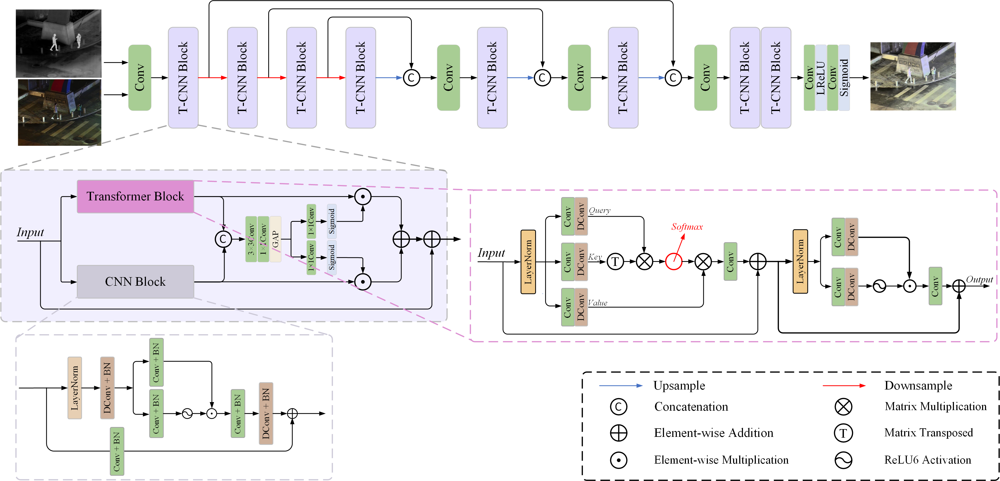

# LEFuse
## 🙌Introduction
* This is the official implementation of our paper titled "LEFuse: Joint low-light enhancement and image fusion for nighttime infrared and visible images". 
* This paper has been accepted by Neurocomputing.
* If you have any question about this code, feel free to reach me(cheng411523@163.com)


-[*[Paper]*](https://www.sciencedirect.com/science/article/pii/S0925231225002644)  

### ⚙ Network Architecture



### ⚙ Visualization


## 🏊Update
- [2025/02] Test code and config files are publicly available.


## 🌐Usage
* Ensure that the data and pre-trained weights are prepared and placed in the designated folder.
* Execute "test.py" to perform the testing.


## Citation
```
@article{cheng2025lefuse,
  title={LEFuse: Joint low-light enhancement and image fusion for nighttime infrared and visible images},
  author={Cheng, Muhang and Huang, Haiyan and Liu, Xiangyu and Mo, Hongwei and Zhao, Xiongbo and Wu, Songling},
  journal={Neurocomputing},
  pages={129592},
  year={2025},
  publisher={Elsevier}
}
``` 

## 📖 Related Work
- Yu Zhang, Xiaoguang Di, Bin Zhang, and Chunhui Wang. Self-supervised image enhancement network: Training with low light images only.arXiv preprint arXiv:2002.11300, 2020.
- Linfeng Tang, Xinyu Xiang, Hao Zhang, Meiqi Gong, and Jiayi Ma. Divfusion: Darkness-free infrared and visible image fusion. Information Fusion, 91:477–493, 2023.
- Zhao Z, Bai H, Zhang J, et al. Cddfuse: Correlation-driven dual-branch feature decomposition for multi-modality image fusion[C]//Proceedings of the IEEE/CVF conference on computer vision and pattern recognition. 2023: 5906-5916.